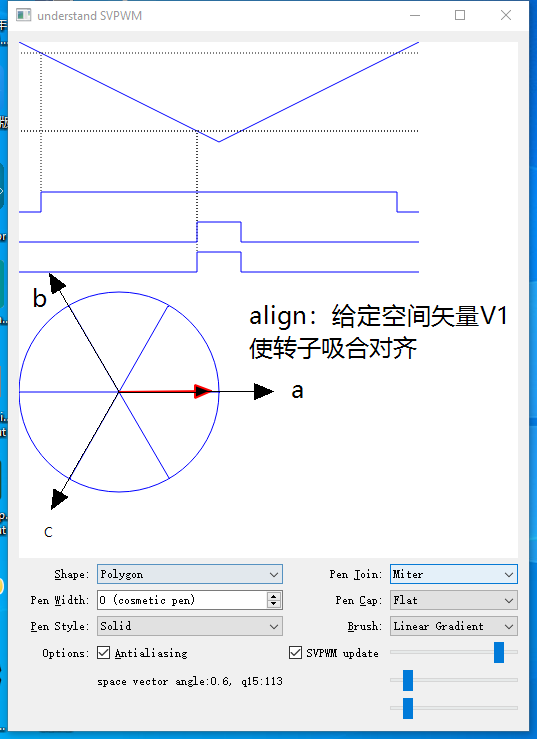
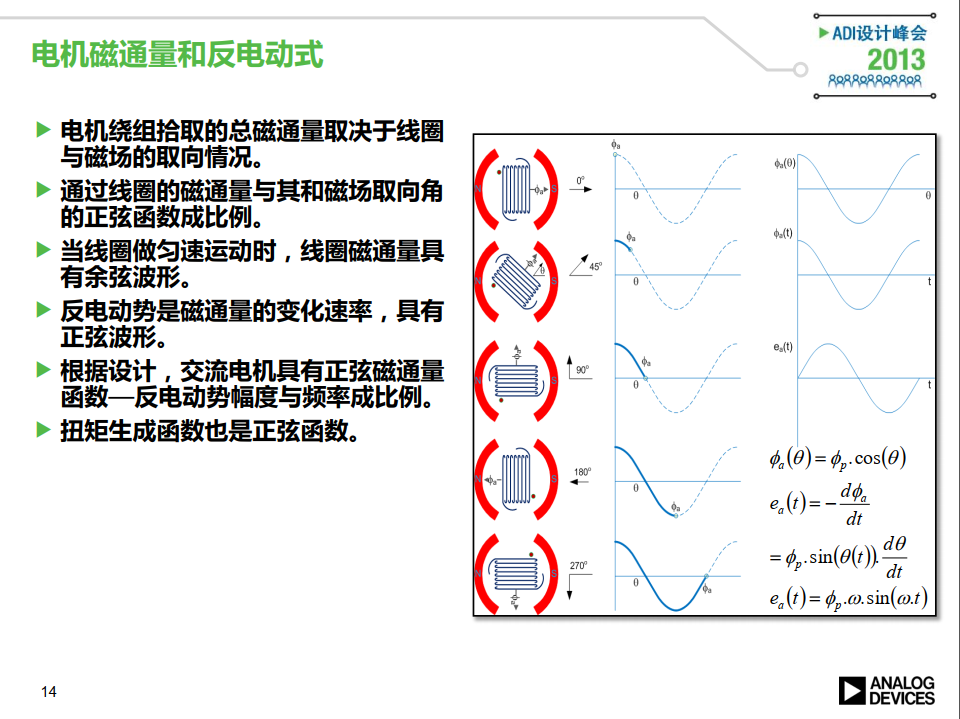
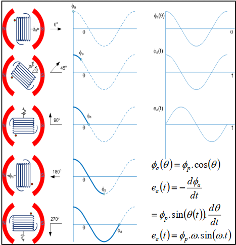
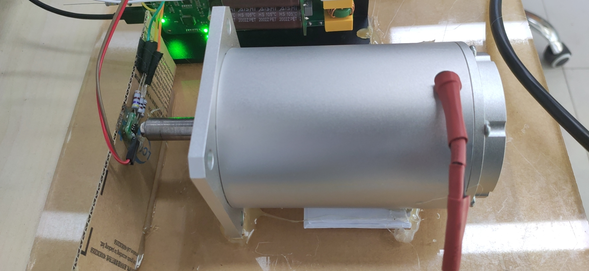
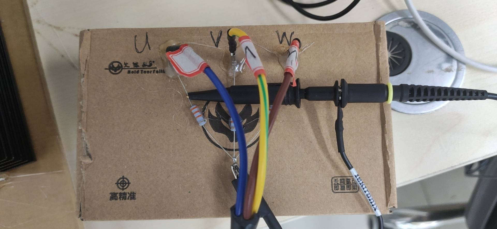
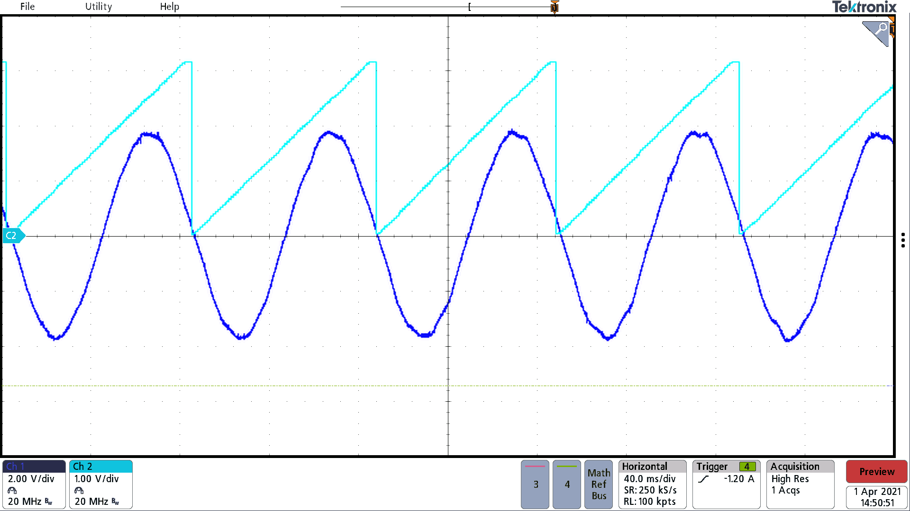
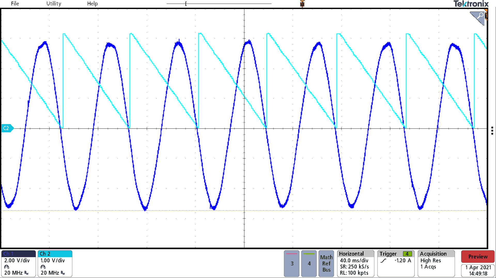
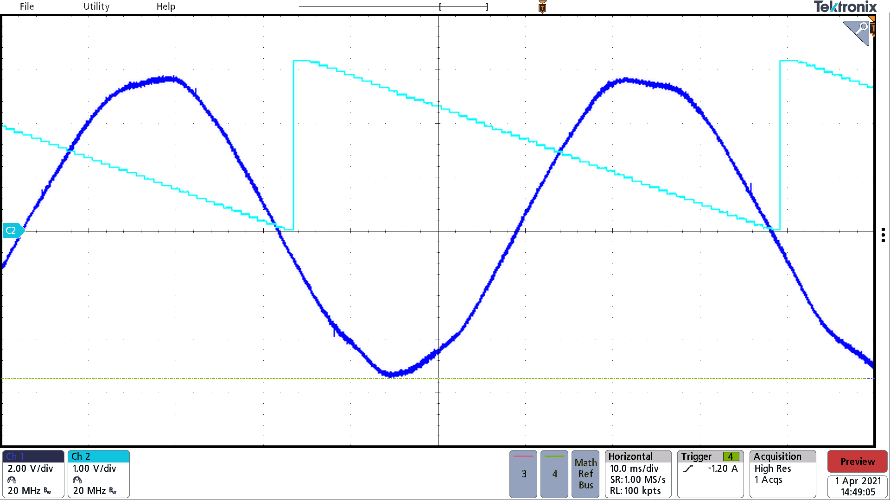

============================
三相电机（中山)反电动势与电角度关系
============================

理论分析
#########################

电角度0 的约定
~~~~~~~~~~~~~~~~~~~~~~~~~

- 当加在线圈上的空间矢量电压(下称V1）与三相定子坐标系A 重合时， 如图即
  

假设此时在定子绕组上生成的电磁铁的磁场水平向右 N极向右， 
则转子（可以看作是永磁铁）会被吸引至水平方向。相当于两个磁铁中心对称。

- 此时对于绕组A，拾取的总磁通最大 （θ=0）
- 通过绕组线圈的磁通量与其和磁场夹角成余弦关系Φa = Φp*cosθ
- 因为反电动势=磁通量的变化率 即ea = dΦa/dt = Φp*ω*sin(ωt）
- 所以当线圈做匀速运动时，反电动势是θ的正弦函数。
  

**结论：电角度为0时 对应a相反电动势过0点，ea呈正弦变化。**

.. Important:: **我们统一将转子与a相对齐时的位置作为电角度0**

.. .. math::
..     :label: math-single

..     \int_1^\infty \frac{1}{x^2} dx = 1

实验验证
#########################

步骤0 实验环境
~~~~~~~~~~~~~~~~~~~~~~~~~

    电机出轴粘了一个单极永磁铁

    电机三相线通过3个30k电阻接出一个中心点N，探头夹U与N

步骤1 转子对齐，磁编归零
~~~~~~~~~~~~~~~~~~~~~~~~~

驱动输出恒定空间电压矢量v1 如前所示 相当于在水平方向生成一个电磁铁

此时转子会被吸合到一个固定角度，此时定为系统电角度0点。
将此时磁编读取的角度offset记录下来。

.. Note:: 磁编输出值theta = 原始值raw - offset

步骤2 电机引出中点N 测量a相反电势ea
~~~~~~~~~~~~~~~~~~~~~~~~~
电机三相线与中点N通过电阻引出，测量a相反电势ea
通过MCU的DAC外设将磁编角度输出为电压波形方便示波器观察

可以看到theta从0~2pi变化时 θ=0对应反电动势过0点。

.. 行内数学公式 :math:`\sin\alpha`

.. .. math::

..     \theta

