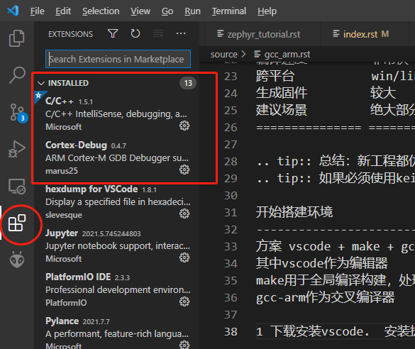
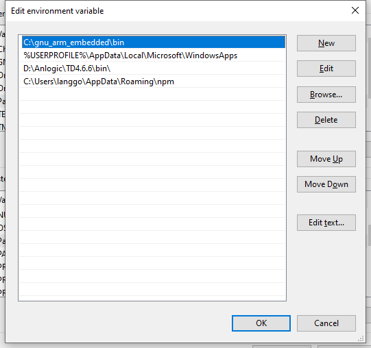
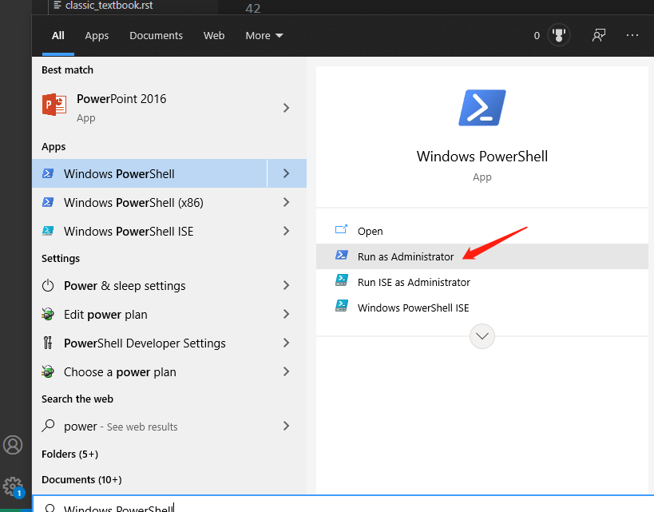
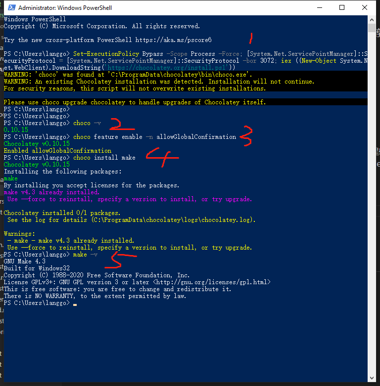
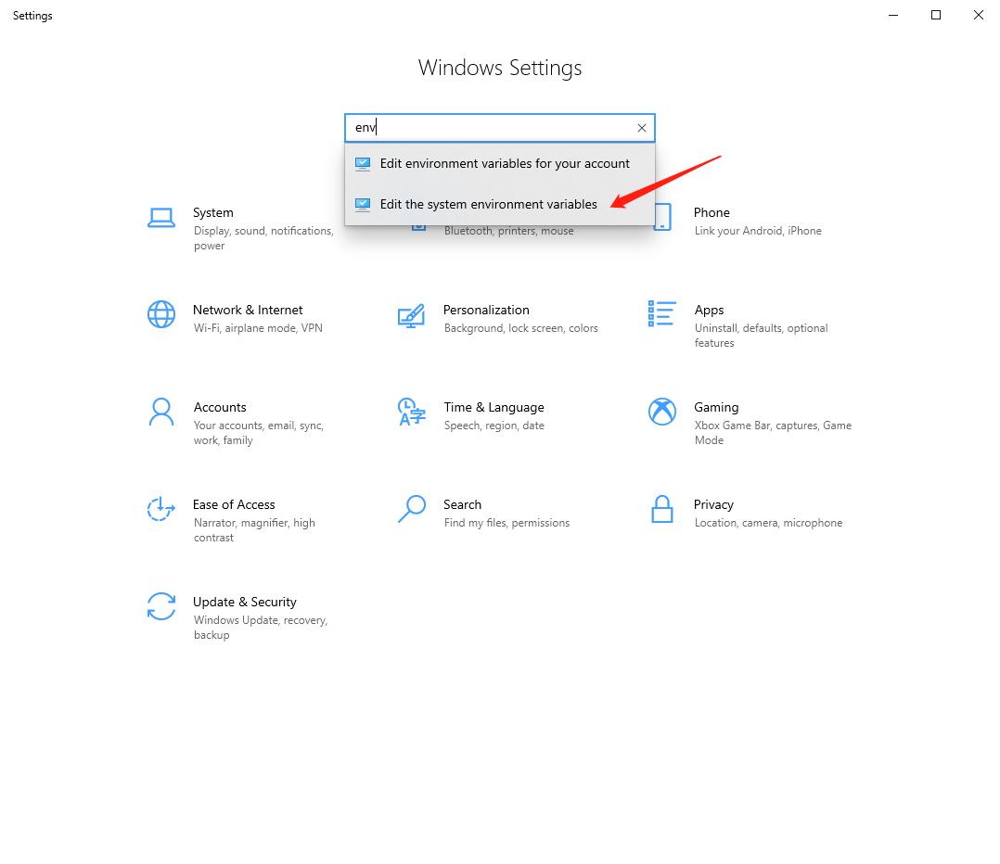
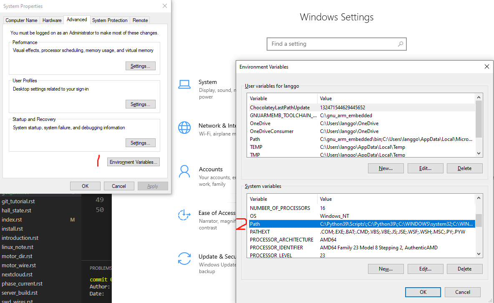
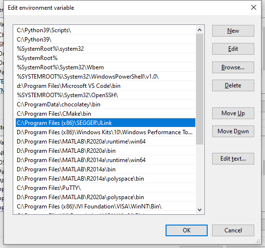

============================
gcc-arm tutorial
============================

什么是GCC？
------------------
gcc是GNU开源社区的一套编译工具链简称 Gnu Compiler Collection
for C, C++, Objective-C, Fortran, Ada, Go, and D, as well as libraries for these languages (libstdc++,...).
也支持多平台win32/amd64/LINUX/macos等。 
是开放源代码的自由软件，无license需求，无法律风险。

什么是GCC-ARM ?
------------------
用于交叉编译运行在arm上的固件所用的编译器。
同理 keil使用的编译器是ARMCC和ARMCLANG（也叫AC6)

=============== ===============  ==================== =================
compiler        gcc_arm          armclang             armcc(将来会废弃）
=============== ===============  ==================== =================
使用许可         商用免费          需要license          需要license
编译速度         非常快            非常快               慢
跨平台           win/linux/mac    win                  win
生成固件         较大              较小                 较小
建议场景         绝大部分应用       flash紧张            不建议使用
=============== ===============  ==================== =================

.. tip:: 总结：新工程都优先使用gcc_arm，开放灵活免费。
.. tip:: 如果必须使用keil，则使用armclang (keil里option--target--code-generation选择AC6）

开始搭建环境
---------------------------
方案 vscode + make + gcc-arm + (ozone/jscope/。。非必需）
其中vscode作为编辑器
make用于全局编译构建，处理依赖关系，编译参数，生成elf以及bin等
gcc-arm作为交叉编译器

安装vscode
-------------------------
下载安装vscode.  安装扩展c/c++(microsoft)   cortex-debug （已放在网盘（Y:\公用工程软件\）

安装gcc-arm
-------------------------
#. 安装gcc-arm-none-eabi-win32.exe（已放在网盘（Y:\公用工程软件\）
安装路径选择 X:\gnu_arm_embedded 并且添加X:\gnu_arm_embedded\bin到系统变量path（如果有选项勾选添加到环境变量就不需要这一步）

安装choco 与 make
------------------------
开始-输入powershell 管理员开powershell 复制以下  回车。

::

    Set-ExecutionPolicy Bypass -Scope Process -Force; [System.Net.ServicePointManager]::SecurityProtocol = [System.Net.ServicePointManager]::SecurityProtocol -bor 3072; iex ((New-Object System.Net.WebClient).DownloadString('https://chocolatey.org/install.ps1'))

::

    choco -v    #查看安装choco成功
    choco feature enable -n allowGlobalConfirmation
    choco install make
    make -v     #查看安装make 可能需要重新启动命令行才可以运行

安装jlink与添加环境变量
------------------------

打开命令行 输入jlink回车 没报错说明安装ok