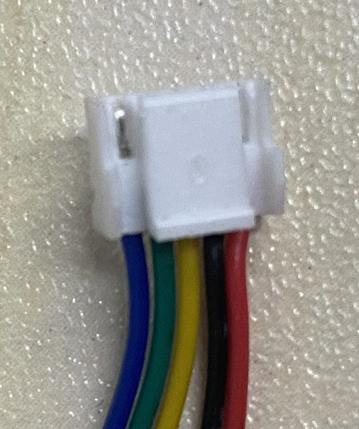

霍尔值定义 hall value define.
=====================================

状态值以C为MSB ，A为LSB
例如状态1 = 001 = HC0 HB0 HA1.

如图2所示，当接线头的卡扣在上面时，从左到右依次为C、B、A、GND、VCC。线序不能变,颜色不做强制要求。
霍尔在软件里的状态值以C为MSB, A为LSB。
取值只使用经典的513264.

.. tip:: 当霍尔传感器60°放置时，需要将B取反。程序示例
    ::

        ... //计算hall_state;

        #if HALL_PLACEMENT == 60
            hall_state ^= 2;    //^010即可将B取反
        #endif

``this is quote`` ::

    pip install xx

