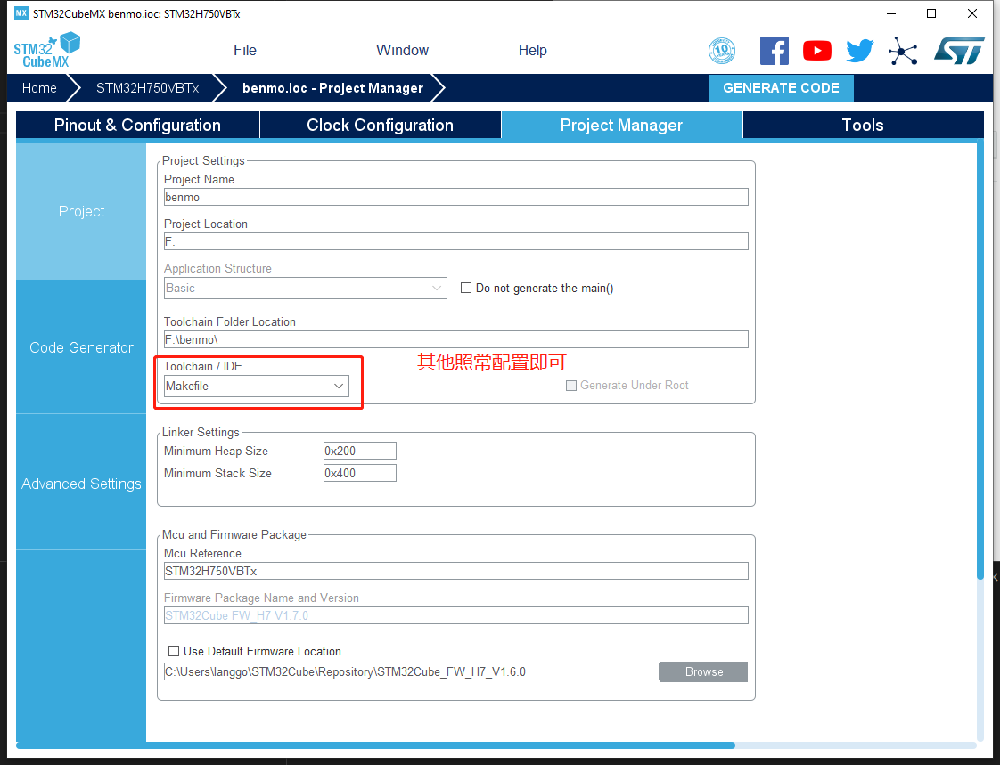
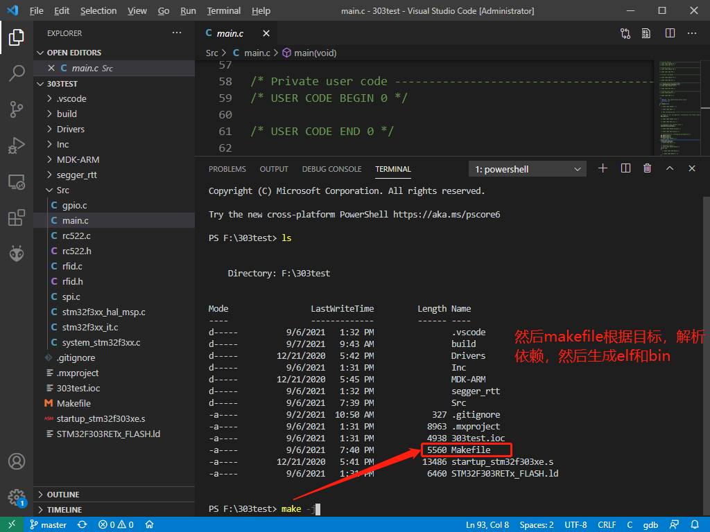
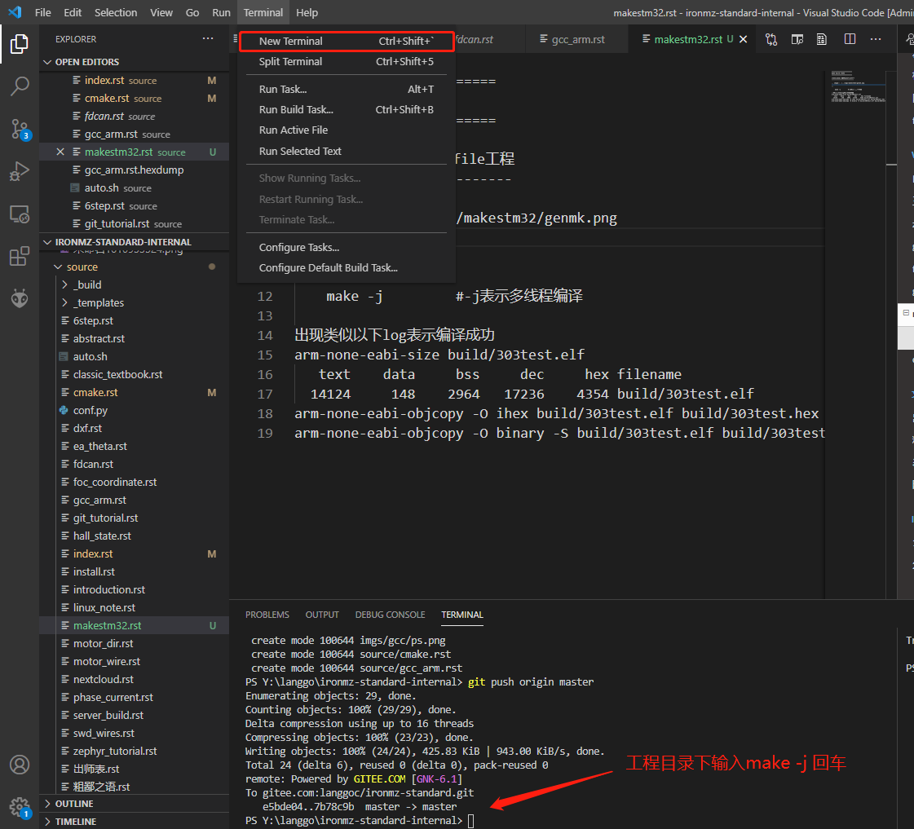

=========================
make build stm32
=========================

stm32cubemx 生成makefile工程
---------------------------

::

    make -j         #-j表示多线程编译

出现类似以下log表示编译成功

::

    arm-none-eabi-size build/303test.elf
    text    data     bss     dec     hex filename
    14124     148    2964   17236    4354 build/303test.elf
    arm-none-eabi-objcopy -O ihex build/303test.elf build/303test.hex
    arm-none-eabi-objcopy -O binary -S build/303test.elf build/303test.bin