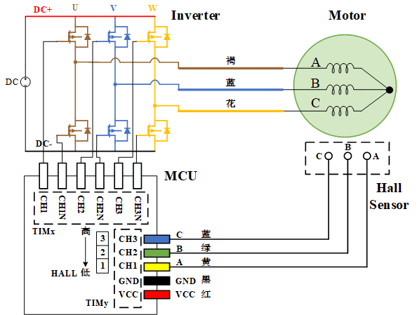
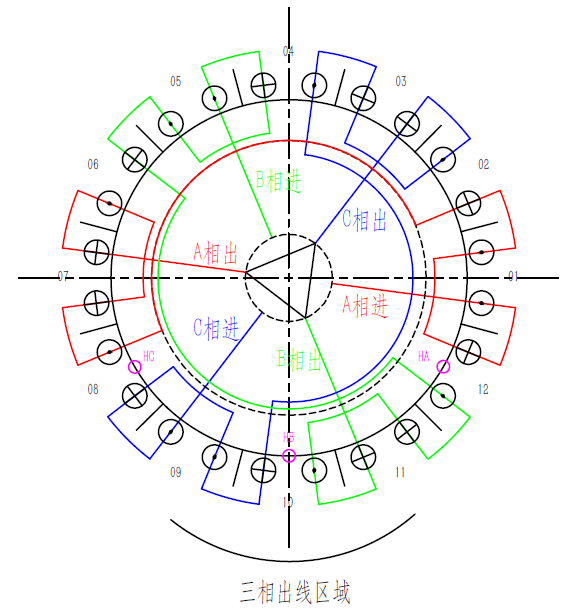

=====================================
电机接线标准 motor wires.
=====================================

需要统一标准的部分
------------------------------------

1. 电机相线
#. 电机霍尔线序
#. 霍尔值

统一以上之后程序在同型号所有电机运行效果应会保持一致

.. warning:: 霍尔对应的通电相序暂时不要求统一,因为不同型号电机安装有差异。

电机相线（本体负责人）
-------------------------------------

- 三根相线U、V、W （或称A、B、C）需要清晰标注！
- 三根相线U、V、W （或称A、B、C）需要清晰标注！
- 三根相线U、V、W （或称A、B、C）需要清晰标注！
保证同型号电机的相线顺序一致。
除非有防呆接头才可不标。
颜色默认花、蓝、褐，可根据实际情况调整。

.. tip:: 条件允许时，电机相线应当使用防呆接口

霍尔接口（本体负责人）
-------------------------------------

.. image:: ./../imgs/hall_con.png
如图2所示，当接线头的卡扣在上面时，从左到右依次为C、B、A、GND、VCC。线序不能变,颜色不做强制要求。
霍尔在软件里的状态值以C为MSB, A为LSB。
若选用GH1.25mm座子，应为带锁型插座，且对应插头卡扣朝上。
取值范围只能使用经典的513264.

- 霍尔A接定时器ch1
- 霍尔B接定时器ch2
- 霍尔C接定时器ch3

.. tip:: 当霍尔传感器60°放置时，需要将B取反。程序示例
    ::

        ... //计算hall_state;

        #if HALL_PLACEMENT == 60
            hall_state ^= 2;    //^010即可将B取反
        #endif

逆变桥臂（驱动负责人）
-------------------------------

- 定时器的CH1、CH1N依次对应U相上管、U相下管
- 定时器的CH2、CH2N依次对应V相上管、V相下管
- 定时器的CH3、CH3N依次对应W相上管、W相下管

以上标准若无异议，应签字盖章通过开始执行。