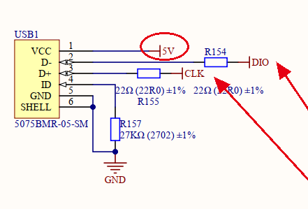
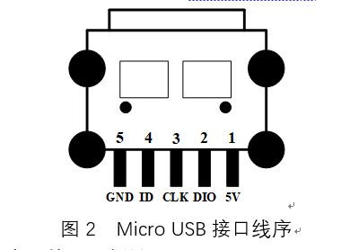
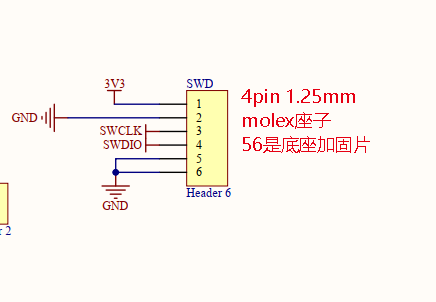
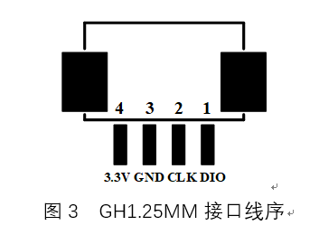
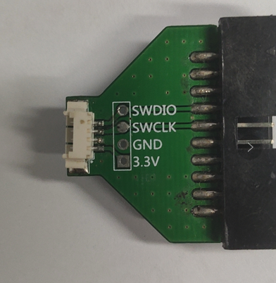

========================
板上SWD接口与线材规范
========================

swd座子可选2种
------------------------

- 选择micro USB座子 电源必须是5V

    

- 选择1.25mm 4pin   电源必须是3.3V

swd 4pin 线材
------------------------

.. image:: ./../imgs/swd-wires.png
    :scale: 50%

必须使用这种线序与端子pin顺序一致的连接线！
线与端子的相对位置应是固定的. ::

    端子上下对折刚好重合

.. tip:: rs485、can、电源连接线、swd下载线都是如此。
.. warning:: uart比较特殊，自行调换tx rx即可。

